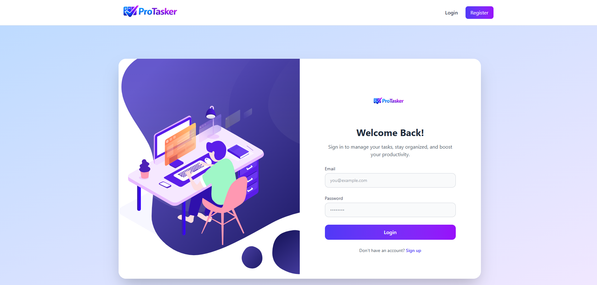

 <h1 align="center"> Pro-Tasker — Full-Stack MERN Application </h1>

##  Project Overview
Pro-Tasker is a modern, collaborative project management web application built using the MERN stack (MongoDB, Express, React, Node.js). It is designed to help individuals and small teams efficiently manage projects and tasks with a clean, intuitive interface and secure backend.
This application demonstrates full-stack development skills including API design, authentication, authorization, database modeling, frontend state management, and deployment.

### Live URLs
* **Frontend:**  https://pro-tasker-mern-full-stack-by-mithra.netlify.app
* **Backend API:**  https://pro-tasker-mern-full-stack-capstone-2n9j.onrender.com



-----------------------------------------------------------------------------------------------------------------
## Features
### User Management
* User registration and login
* Secure authentication using JWT
* Password hashing with bcrypt
* Persistent login sessions
* Logout functionality
### Project Management
* Create, update, and delete projects
* View all projects owned by the user
* View individual project details
* Ownership-based access control
### Task Management
* Create tasks within projects
* Update task details and status (To Do, In Progress, Done)
* Delete tasks
* View all tasks for a project
---
## Tech Stack
### Backend
* Node.js
* Express.js
* MongoDB (MongoDB Atlas)
* Mongoose
* JSON Web Tokens (JWT)
* bcrypt
* dotenv
### Frontend
* React (Vite)
* React Router DOM
* Context API
* Axios / Fetch API
* TailwindCSS
* JavaScript
* Deployment
* Netlify (Frontend)
* Render (Backend )
* MongoDB Atlas (Database)
---
## Project Structure
### Backend Structure
````
pro-tasker/
└── backend/
    ├── config/
    │   └── connection.js         # MongoDB connection setup
    │
    ├── controllers/
    │   ├── userControllers.js    # Register & login logic
    │   ├── projectControllers.js
    │   └── taskControllers.js
    │
    │
    ├── models/
    │   ├── User.js              # User schema
    │   ├── Project.js           # Project schema
    │   └── Task.js              # Task schema
    │
    ├── routes/
    │   ├── userRoutes.js
    │   ├── projectRoutes.js
    │   └── taskRoutes.js
    │
    ├── utils/
    │   └── auth.js              # JWT helper
    │
    ├── .env
    ├── .gitignore
    ├── package.json
    └── server.js                # Entry point
````
### Frontend Structure
````
pro-tasker/
└── frontend/
    ├── public/
    │   └── _redirects
    │
    ├── src/
    │   ├── assets/
    │
    │   ├── components/
    │   │   ├── Navbar.jsx
    │   │   ├── ProjectCard.jsx
    │   │   ├── TaskCard.jsx
    │   │   ├── Spinner.jsx
    │   |   ├── ErrorMessage.jsx
    |   |   ├──SearchCard.jsx
    |   |   ├──StatsCard.jsx
    |   |   ├──TaskStatusCard.jsx
    |   |
    │   ├── pages/
    │   │   ├── Login.jsx
    │   │   ├── Register.jsx
    │   │   ├── Dashboard.jsx
    │   │   └── ProjectDetails.jsx
    │   |
    │   ├── context/
    │   │   ├── UserContext.jsx
    |   |   ├──GlobalStateContext.jsx
    │   |
    |   ├── hooks/
    |   |   ├──useCalculate.js
    |   |   ├──useValidate.js
    |   |
    │   ├── client/
    │   │   └── api.js            
    │   |
    │   ├── App.jsx
    │   ├── main.jsx
    │   └── index.css
    │
    ├── .env
    ├── package.json
    └── vite.config.js
````
---
### Authentication & Authorization
* JWT-based authentication
* Protected routes using middleware
* Ownership-based authorization:
* Users can only access their own projects
* Tasks are restricted to their parent project owner
---
### API Endpoints
## API Routes

### Auth Routes

| Method | Endpoint | Description |
|------|------|------|
| POST | /api/users/register | Register a new user |
| POST | /api/users/login | Login user |

---

### Project Routes

| Method | Endpoint | Description |
|------|------|------|
| GET | /api/projects | Get all user projects |
| POST | /api/projects | Create a new project |
| GET | /api/projects/:projectId | Get a single project |
| PUT | /api/projects/:projectId | Update a project |
| DELETE | /api/projects/:projectId | Delete a project |

---

### Task Routes

| Method | Endpoint | Description |
|------|------|------|
| GET | /api/projects/:projectId/tasks | Get tasks for a project |
| POST | /api/projects/:projectId/tasks | Create a new task |
| PUT | /api/tasks/:taskId | Update a task |
| DELETE | /api/tasks/:taskId | Delete a task |
### Environment Variables
* Create a .env file in the backend directory:
```
PORT=3000
MONGO_URI=your_mongodb_connection_string
JWT_SECRET=your_secret_key
```
### Installation & Setup
1. Clone Repository
```
git clone https://github.com/Mith29/pro-tasker-MERN-full-stack-capstone-project
cd pro-tasker-MERN-full-stack-capstone-project    
```
2. Backend Setup
```
cd pro-tasker-backend
npm install
npm run dev
```
3. Frontend Setup
```
cd pro-tasker-frontend
npm install
npm run dev
```
### Deployment
* Backend
  -Deployed as a Web Service on Render
  -Connected to MongoDB Atlas
* Frontend
  -Deployed as a Static Site on Netlify
  -Configured to communicate with backend API

### Responsive Design
* Fully responsive UI
* Works across desktop, tablet, and mobile devices
### Challenges & Learnings
* Implementing secure authorization logic
* Managing global state with Context API
* Structuring a scalable backend architecture
* Handling async API calls and UI states
### Future Improvements
* Real-time collaboration 
* Due date for projects
* Role-based permissions
### Author
#### Gnanamithra Venugopal

Full-Stack Developer
